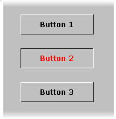



## Hover Buttons

### Description

Hover Buttons. Like the Internet Explorer menu buttons. Check it out. And.. if you like it... please vote... ;)
 
### More Info
 

             |
---                |---
**Submitted On**   |2000-07-17 17:27:36
**By**             |[Andreas Åhlfeldt](https://github.com/Planet-Source-Code/PSCIndex/blob/master/ByAuthor/andreas-hlfeldt.md)
**Level**          |Intermediate
**User Rating**    |3.8 (15 globes from 4 users)
**Compatibility**  |VB 3\.0, VB 4\.0 \(16\-bit\), VB 4\.0 \(32\-bit\), VB 5\.0, VB 6\.0, VB Script, ASP \(Active Server Pages\) 
**Category**       |[Custom Controls/ Forms/  Menus](https://github.com/Planet-Source-Code/PSCIndex/blob/master/ByCategory/custom-controls-forms-menus__1-4.md)
**World**          |[Visual Basic](https://github.com/Planet-Source-Code/PSCIndex/blob/master/ByWorld/visual-basic.md)
**Archive File**   |[CODE\_UPLOAD78917182000\.zip](https://github.com/Planet-Source-Code/andreas-hlfeldt-hover-buttons__1-9853/archive/master.zip)

